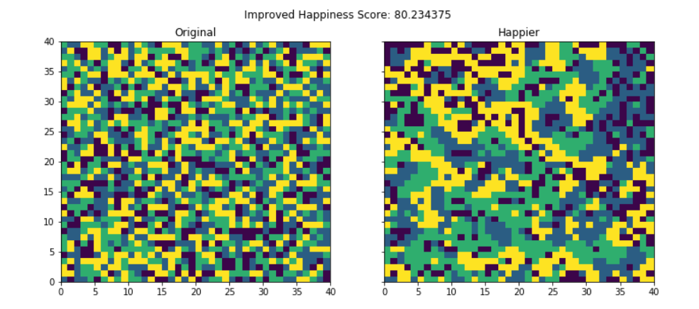

# AgentBase
Agent base simulation for  Segregation modelling in Python

This code is ABM with a very simple behaviour criterion on how the demographics of a city would evolve based on race. It is supposed that people will feel more comfortable/happy living in a neighbourhood with people of the same race.  
The code randomly position people of number of races(specified in the code) in a grid representing a rectangular city, along with some empty cells. The agent’s behaviour is to move to an empty spot if their neighbours are NOT predominantly of the same race. 
This will loop thousands and thousands of times until the level of happiness across the city is above the specified level. 

